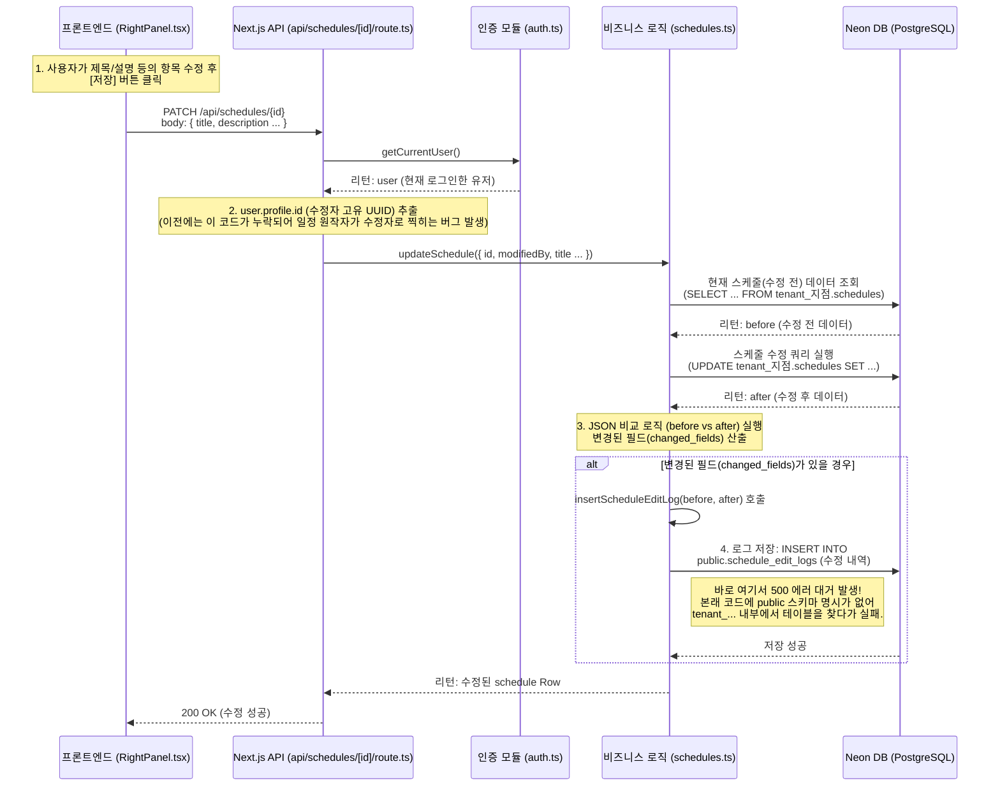
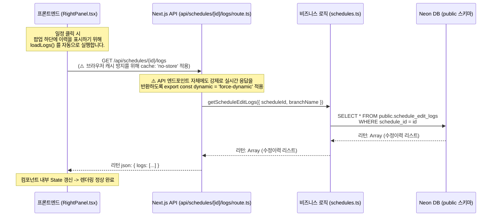

# 일정 수정 이력 데이터 플로우

현재 접속 가능한 `GA_NEXUS` 환경에서 구현되어 있는 **[일정] -> [편집] -> [수정] -> [수정이력 조회]** 의 풀 스택 파이프라인 매핑입니다.

어느 부분에서 문제가 발생했었는지 파악하실 수 있도록 관련된 모든 단계의 코드 스크립트 위치 및 DB 스키마 로직을 도식화했습니다.

## 1. 일정 수정 파이프라인 (Data Write)

사용자가 **일정 편집 팝업에서 "저장" 버튼**을 클릭할 때 발생하는 플로우입니다.

## 2. 수정 이력 조회 파이프라인 (Data Read)

팝업이 다시 열려서 **"수정 이력"** 섹션을 렌더링하기 위해 동작하는 플로우입니다.

---

## 핵심 체크 포인트 요약

현재 로직에서 **"왜 이력이 안 남았거나, 남아도 화면에 뜨지 않았던 것인지"** 체크하는 주요 3대 방어선입니다.

1. **DB 계층 (public vs tenant 스키마):**
   - 사용자 테이블 등은 지점(Branch)에 따른 별도의 테넌트 스키마(`tenant_GA4_7`)에 있습니다. 
   - 그러나 수정 로그 테이블인 `schedule_edit_logs`는 예외적으로 공통 경로인 **`public`** 영역에 만들어져 있습니다! 
   - *문제점:* 코드가 `tenant_GA4_7.schedule_edit_logs` 에서 읽고 쓰려 했기 때문에 조용히 실패했습니다. (현재 코드는 명시적으로 `public.schedule_edit_logs` 를 참조하도록 고쳐졌습니다.)
2. **비즈니스 엔진 (schedules.ts 내부 비교 로직):**
   - JavaScript의 [Date](file:///c:/Users/chlgn/OneDrive/Desktop/GA_NEXUS/app/components/RightPanel.tsx#47-57) 객체(시작일, 종료일) 비교 시 단순 `!==` 연산자를 사용해 무조건 값이 "다르다"고 인식하거나 객체 직렬화가 깨지는 버그를 가지고 있었습니다. 
   - (현재는 타임스탬프 `.getTime()` 비교법을 적용하여 안전해졌습니다.)
3. **프론트엔드/API 캐싱 계층 (Next.js App Router):**
   - 처음 코드가 고장나서 빈 빈열(`[]`)을 반환했을 때, Next.js의 내장 브라우저 캐싱과 API 라우트 캐싱이 이를 영원히 기억했습니다.
   - DB는 정상적으로 수정되어 로그가 쌓여도 요청 시 **'캐시된 빈 배열'**만 뱉고 있었습니다.
   - (현재 `cache: 'no-store'` 와 `force-dynamic` 로 캐싱을 터트려 매 요청 다시 DB를 불러오게 고쳐졌습니다.)
