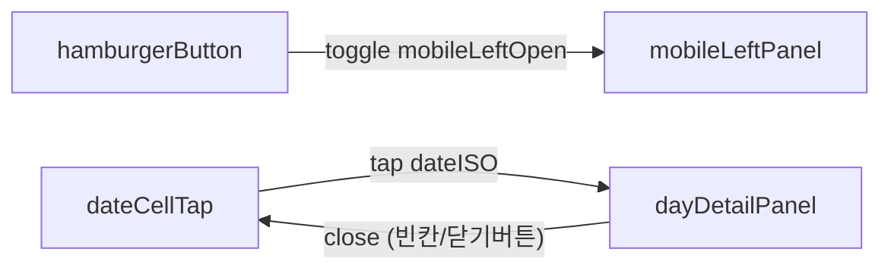

## 모바일 앱 모드 캘린더/패널 레이아웃

### 1. 레이아웃 개요

- 상단 헤더
  - 좌측: `GA` 로고 + 타이틀/서브타이틀
  - 우측: 햄버거 버튼(세 줄 메뉴) → 탭 시 좌측 패널 오버레이 오픈
- 중앙 섹션
  - 상단: 월/연도 라벨 + `Today` 버튼
  - 본문: 5열(월~금) 고정 캘린더 그리드
  - 하단: 선택된 날짜의 일정 상세 패널(슬라이드 인/아웃)
- 좌측 패널(모바일 전용)
  - 화면 전체를 덮는 반투명 백드롭 + 왼쪽에서 슬라이드 인하는 패널
  - 내용: 브랜치 멤버 리스트(`LeftPanelBranchMembers` 재사용)

### 2. 핵심 상태

- `MobileCalendarShell` (클라이언트 컴포넌트)에서 관리
  - `mobileLeftOpen: boolean`
    - `true`: 좌측 브랜치 멤버 패널 오픈
    - `false`: 닫힘
  - `selectedDateForDetail: string | null`
    - 상세 패널이 가리키는 날짜 (ISO `YYYY-MM-DD`)
    - `null`: 현재 상세 패널이 특정 날짜를 가리키지 않음
  - `detailOpen: boolean`
    - `true`: 하단 상세 패널 표시
    - `false`: 상세 패널 숨김

### 3. 상호작용 규칙

#### 3.1 햄버거 버튼 / 좌측 패널

- 상단 헤더 우측 햄버거 버튼 탭 → `mobileLeftOpen = true`
- 오버레이:
  - `fixed inset-0` 백드롭(`bg-black/40`)
  - 왼쪽 `w-72` 패널 안에 `LeftPanelBranchMembers` 렌더링
  - 패널 상단에 \"Branch Members\" 타이틀 + `닫기` 버튼
- 백드롭 또는 닫기 버튼 탭 → `mobileLeftOpen = false`

#### 3.2 날짜 선택 / 상세 패널

- `CalendarGridClient`에 `onDateSelect(dateISO)` 콜백 추가
  - 모바일에서는 `router.push` 대신 이 콜백을 사용
  - 데스크톱에서는 기존대로 URL 쿼리 + 우측 패널 오픈
- 동작:
  - 날짜 셀 탭:
    - `dateISO`가 없으면 무시
    - 이미 `detailOpen = true` 이고 `selectedDateForDetail === dateISO` 인 경우:
      - → 상세 패널 닫기 (`detailOpen = false`, `selectedDateForDetail = null`)
    - 그 외(처음 열거나 다른 날짜):
      - `selectedDateForDetail = dateISO`
      - `detailOpen = true`
  - 상단 `Today` 버튼 / 상세 패널 헤더의 `닫기` 버튼 탭:
    - `detailOpen = false`, `selectedDateForDetail = null`

### 4. UI 세부 구성

#### 4.1 모바일 헤더

- 컴포넌트: `MobileCalendarShell`
- 구조:
  - 좌: `GA` 로고, `Management Portal` / `Main Calendar` 텍스트
  - 우: 햄버거 버튼

#### 4.2 캘린더 카드

- 기존 `CalendarGridClient`를 모바일에서도 사용하되:
  - `columns={5}` 고정
  - `onDateSelect={handleDateSelect}` 전달
  - `selectedDateStr`는 `selectedDateForDetail` 사용
  - `Today` 버튼은 상세 패널 닫기 역할을 겸함

#### 4.3 상세 패널

- `MobileCalendarShell` 내부에서 구현
- 상태에 따라 슬라이드 인/아웃:
  - `detailOpen = true`:
    - `max-h-[320px] opacity-100 translate-y-0`
  - `detailOpen = false`:
    - `max-h-0 opacity-0 -translate-y-2`
- 내용:
  - 헤더:
    - 선택 날짜를 `YYYY년 M월 D일 일정` 형식으로 출력
    - 오른쪽에 `닫기` 텍스트 버튼
  - 본문:
    - 해당 날짜 일정 목록 (`eventsByDateStr[dateISO]`)을 카드 형식으로 렌더링
    - 없으면 \"해당 날짜에는 일정이 없습니다.\" 표시

### 5. 데스크톱 / 모바일 분기

- `app/page.tsx`에서 공통 데이터(`calendarCells`, `eventsByDay`, `eventsByDateStr`)를 계산한 뒤:
  - 데스크톱(`lg:flex`):
    - 기존 `DesktopShell` + `CalendarGridClient` + `RightPanel` 조합 그대로 사용
  - 모바일:
    - 기존 모바일 레이아웃(하단 가로 슬라이드, `BranchMembersCard`) 제거
    - 대신 `MobileCalendarShell` 하나로 헤더/캘린더/상세/좌측 패널을 관리

### 6. 요약

- 햄버거 버튼 → 좌측에 **브랜치 멤버 패널**을 오버레이로 슬라이드 인.
- 날짜 탭 → 선택 날짜 기준으로 하단 **일정 상세 패널**을 슬라이드 인.
- 같은 날짜/닫기 동작 → 상세 패널 닫고, 달력만 남는 상태로 복귀.
- 데스크톱은 기존 구조를 유지하고, 모바일만 새로운 상호작용/레이아웃을 사용해 UX를 개선했다.

